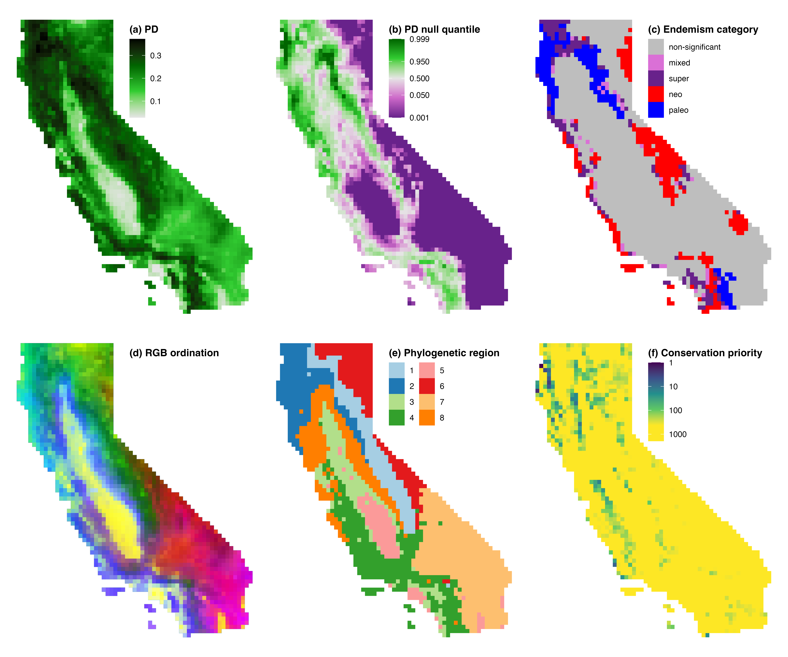

# Supporting information for `phylospatial` manuscript

This project contains the code and data for the example analysis included in the paper **Kling (2025) `phylospatial`: an R package for spatial phylogenetic analysis with quantitative community data. Methods in Ecology and Evolution**.

This paper documents the `phylospatial` library, which is available on [Github](https://github.com/matthewkling/phylospatial) and on [CRAN](https://cran.r-project.org/package=phylospatial). Running the script "phylospatial.R" should reproduce Figure 3 of the paper, shown below.

The data used in the paper are originally from the following studies:
- Thornhill et al. 2017: https://doi.org/10.1186/s12915-017-0435-x
- Kling et al. 2018: https://doi.org/10.1098/rstb.2017.0397

This repo has been archived on Zenodo:

_Figure 3: A subset of the results generated by the code examples analyzing spatial phylogenetic patterns for the 5221 native vascular plant species of California. (a) Phylogenetic diversity (PD); values represent the fraction of total phylogenetic branch length represented in a given site. (b) Statistical significance of PD calculated using a randomization-based null model that controls for species richness; sites in dark green and dark purple are significantly high and low in PD, respectively. (c) CANAPE classification of communities with significant endemism characteristics; see \cite{Mishler2014} for descriptions of each category. (d) Phylogenetic community ordination mapped onto color space, with color similarity representing plant community similarity. (e) Phylogenetic regions representing discrete areas that are relatively homogeneous and distinct from one another. (f) Priority sites for the creation of new protected areas for the conservation of California plants._
